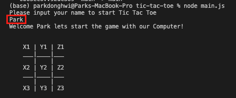

<div id="top"></div>

![LinkedIn][linkedin-shield][linkedin-url]

<!-- PROJECT LOGO -->
<br />
<div align="center">
  <p align="center">
    
  </p>

  <h3 align="center">Tic Tac Toe game documentation by Donghwi Park!</h3>

  <p align="center">
    A reference for Tic Tac Toe game with Javascript!
    <br />
  </p>
</div>

<!-- TABLE OF CONTENTS -->
<details>
  <br />
  <summary>Table of Contents</summary>
  <br />
  <ol>
    <li>
      <a href="#about-the-project">About The Project</a>
      <ul>
        <li><a href="#built-with">Built With</a></li>
      </ul>
    </li>
    <li>
      <a href="#getting-started">Getting Started</a>
      <ul>
        <li><a href="#prerequisites">Prerequisites</a></li>
        <li><a href="#installation">Installation</a></li>
      </ul>
    </li>
    <li><a href="#usage">Usage</a></li>
    <li><a href="#acknowledgments">Acknowledgments</a></li>
  </ol>
</details>
    <br />

<!-- ABOUT THE PROJECT -->

## About The Project

<br />
<p align="center">
  
</p>
<br />
This is the Tic Tac Toe game which can compete with Computer.

Here's the features you can enjoy:

- You can choose your name while playing
- The result will be automatically showing up
- You can exit whenever you want after typing exit on command

Please read below and enjoy the game

<p align="right">(<a href="#top">back to top</a>)</p>

### Built With

- [Javascript](https://www.javascript.com/)
- [Node JS](https://nodejs.org/en/)
- [readline](https://nodejs.org/api/readline.html)

<p align="right">(<a href="#top">back to top</a>)</p>
    <br />

<!-- GETTING STARTED -->

## Getting Started

This is an example of how you can start the game

### Prerequisites

You need to have Node JS installed in your local environment

- Node js
  ```sh
  sudo apt install nodejs
  ```

### Installation

Instruction how to install the game

1. Make sure you installed the Node JS [https://nodejs.org/en/download/](https://nodejs.org/en/download/)
2. Clone the repo
   ```sh
   git clone https://github.com/donghwipark/tic-tac-toe.git
   ```
3. Start game with opening `main.js` file after move to the local repo
   ```js
   node ./main.js
   ```

<p align="right">(<a href="#top">back to top</a>)</p>
    <br />

<!-- USAGE EXAMPLES -->

## Usage

1. First input your name
<p align="center">
  
</p>

2. Input your desired location on the board(Automatically change to Capital letter)
<p align="center">
  
</p>

3. Wait till computer decide location
<p align="center">
  
</p>

4. Result will show automatically. It will show who wins the game.
<p align="center">
  
</p>

5. Player win case
<p align="center">
  
</p>

6. Computer win case
<p align="center">
  
</p>

7. Tied case
<p align="center">
  
</p>

<p align="right">(<a href="#top">back to top</a>)</p>

<!-- CONTACT -->

## Contact

Your Name - donghwipark@gmail.com

Project Link: [https://github.com/donghwipark/tic-tac-toe](https://github.com/donghwipark/tic-tac-toe)

<p align="right">(<a href="#top">back to top</a>)</p>

<!-- MARKDOWN LINKS & IMAGES -->
<!-- https://www.markdownguide.org/basic-syntax/#reference-style-links -->

[linkedin-shield]: https://img.shields.io/badge/-LinkedIn-black.svg?style=for-the-badge&logo=linkedin&colorB=555
[linkedin-url]: https://www.linkedin.com/in/donghwipark/
[product-screenshot]: images/screenshot.png
